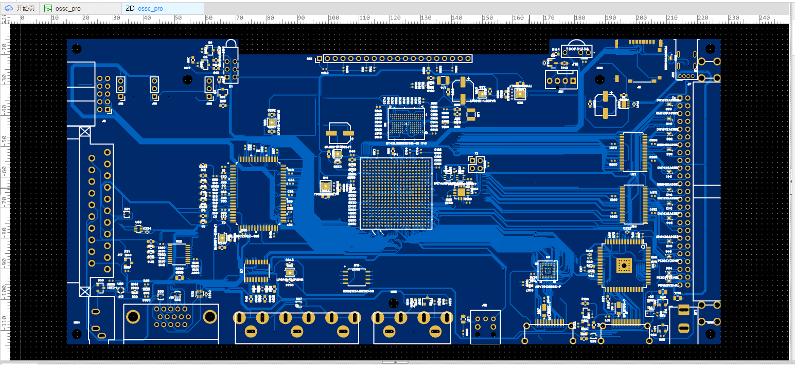
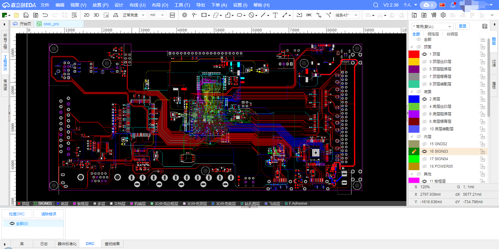

# OSSC Pro HW with layout
==============

## No actual PCB was built from these files to validate the manufacturing.

This PCB full routing, but I don't know how to make the trace length equal within a byte group.

I share this PCB, may someone can finish it.

